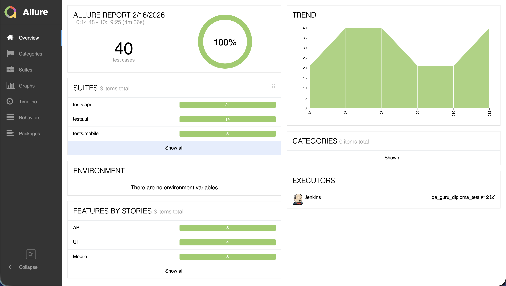
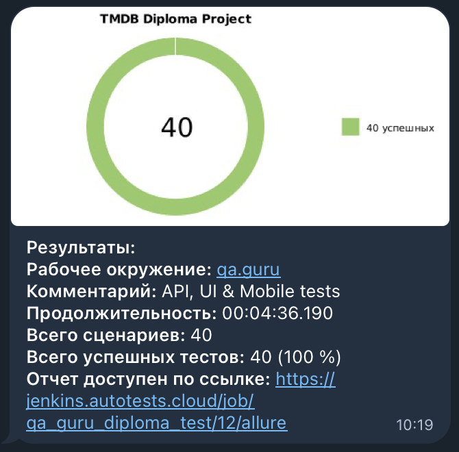

# Дипломный проект по автоматизации тестирования

<p align="center">
  
  
  
  
  
  
  
  
  
</p>

---

## Содержание

- [О проекте](#о-проекте)
- [Технологии и инструменты](#технологии-и-инструменты)
- [Структура проекта](#структура-проекта)
- [Покрытый функционал](#покрытый-функционал)
- [Запуск тестов](#запуск-тестов)
- [Jenkins](#jenkins)
- [Allure Report](#allure-report)
- [Telegram уведомления](#telegram-уведомления)

---

## О проекте

Дипломный проект по курсу **QA Guru** — комплексная автоматизация тестирования, объединяющая три направления в одном репозитории:

| Направление | Продукт | Описание |
|:-----------:|:-------:|:--------:|
| **UI** | [TMDB](https://www.themoviedb.org) | Web-автотесты с PageObject и Selenoid |
| **API** | [TMDB API](https://developer.themoviedb.org) | REST API тесты с Pydantic-моделями |
| **Mobile** | [Wikipedia Android](https://play.google.com/store/apps/details?id=org.wikipedia) | Мобильные тесты через Appium + BrowserStack |

> UI и API тестируют один продукт (TMDB) — данные из API используются для подготовки UI-тестов.

---

## Технологии и инструменты

| Инструмент | Назначение |
|:----------:|:----------:|
| Python | Язык программирования |
| Pytest | Тестовый фреймворк |
| Selene | Обёртка над Selenium/Appium |
| Selenium | Автоматизация браузеров |
| Appium | Мобильная автоматизация |
| Pydantic | Валидация данных и моделей |
| Requests | HTTP-клиент для API |
| Allure Report | Отчётность |
| Selenoid | Удалённый запуск браузеров |
| BrowserStack | Облачные мобильные устройства |
| Jenkins | CI/CD |
| Telegram | Уведомления |

---

## Структура проекта

```
qa_guru_diploma/
├── config.py                       # Настройки (Pydantic Settings)
├── conftest.py                     # Корневые фикстуры
├── pytest.ini                      # Конфигурация Pytest
├── requirements.txt                # Зависимости
│
├── tmdb_api/                       # API клиент (TMDB)
│   ├── client.py                   # HTTP-клиент с Allure-логированием
│   └── models/                     # Pydantic-модели (request & response)
│       ├── movie.py
│       ├── search.py
│       ├── authentication.py
│       └── rating.py
│
├── pages/                          # Page Objects (TMDB Web)
│   ├── main_page.py
│   ├── search_page.py
│   ├── movie_page.py
│   └── login_page.py
│
├── wiki_mobile/                    # Mobile Screens (Wikipedia)
│   ├── config.py                   # 2 конфига: local + BrowserStack
│   └── screens/
│       ├── onboarding_screen.py
│       ├── main_screen.py
│       ├── search_screen.py
│       └── article_screen.py
│
├── utils/                          # Утилиты
│   ├── attach.py                   # Вложения для Allure
│   ├── api_logging.py              # Логирование API (curl + console)
│   └── notifier.py                 # Telegram-уведомления
│
└── tests/
    ├── api/                        # API тесты (21 тест)
    │   ├── test_trending.py
    │   ├── test_search_api.py
    │   ├── test_movie_details.py
    │   ├── test_authentication.py
    │   └── test_rating.py
    ├── ui/                         # UI тесты (14 тестов)
    │   ├── test_main_page.py
    │   ├── test_search.py
    │   ├── test_movie_page.py
    │   └── test_login.py
    └── mobile/                     # Mobile тесты (5 тестов)
        ├── test_onboarding.py
        ├── test_search.py
        └── test_article.py
```

---

## Покрытый функционал

### API тесты (TMDB API)

| Метод | Эндпоинт | Проверки |
|:-----:|:--------:|:--------:|
| `GET` | `/trending/movie/week` | Статус, схема, список фильмов |
| `GET` | `/search/movie` | Поиск по названию, пустой запрос, параметризация |
| `GET` | `/movie/{id}` | Детали фильма, несуществующий фильм (404) |
| `GET` | `/movie/{id}/credits` | Актёрский состав |
| `GET` | `/authentication/guest_session/new` | Создание гостевой сессии |
| `POST` | `/movie/{id}/rating` | Оценка фильма (разные значения) |
| `DELETE` | `/movie/{id}/rating` | Удаление оценки |

### UI тесты (TMDB Web)

| Раздел | Тесты |
|:------:|:-----:|
| Главная страница | Поисковая строка, трендовые фильмы, навигация, популярные |
| Поиск | Поиск трендового фильма (из API), параметризованный поиск, загрузка результатов |
| Страница фильма | Заголовок, описание, рейтинг |
| Авторизация | Наличие полей формы, логин с невалидными данными |

### Mobile тесты (Wikipedia Android)

| Раздел | Тесты |
|:------:|:-----:|
| Onboarding | Отображение, пропуск онбординга |
| Поиск | Поиск статьи, содержимое результатов |
| Статья | Открытие статьи из результатов поиска |

---

## Запуск тестов

### Предварительные шаги

```bash
# Клонировать репозиторий
git clone <repo-url>
cd qa_guru_diploma

# Создать виртуальное окружение
python -m venv venv
source venv/bin/activate  # macOS/Linux
# venv\Scripts\activate   # Windows

# Установить зависимости
pip install -r requirements.txt

# Создать .env файл из шаблона
cp .env.example .env
# Заполнить .env своими значениями
```

### Запуск по группам

```bash
# Все тесты
pytest tests/

# Только API тесты
pytest tests/ -m api

# Только UI тесты
pytest tests/ -m ui

# Только Mobile тесты
pytest tests/ -m mobile

# Smoke тесты
pytest tests/ -m smoke
```

### Allure отчёт

```bash
# Сгенерировать и открыть отчёт
allure serve allure-results
```

---

## Jenkins

> Ссылка на Job: [qa_guru_diploma_test](https://jenkins.autotests.cloud/job/qa_guru_diploma_test/)

Параметризованный запуск с выбором тестового набора (`all`, `api`, `ui`, `mobile`), браузера и версии.

---

## Allure Report

Пример отчёта — **40 тестов, 100% успешных**:

<p align="center">
  
</p>

Каждый тест содержит:
- Шаги выполнения (`@allure.step`)
- Скриншот на момент завершения
- HTML-код страницы
- Видео прохождения (при запуске через Selenoid)
- curl-запрос и JSON-ответ (для API тестов)

---

## Telegram уведомления

По завершении тестового прогона отправляется уведомление в Telegram со статистикой и ссылкой на Allure-отчёт:

<p align="center">
  
</p>
